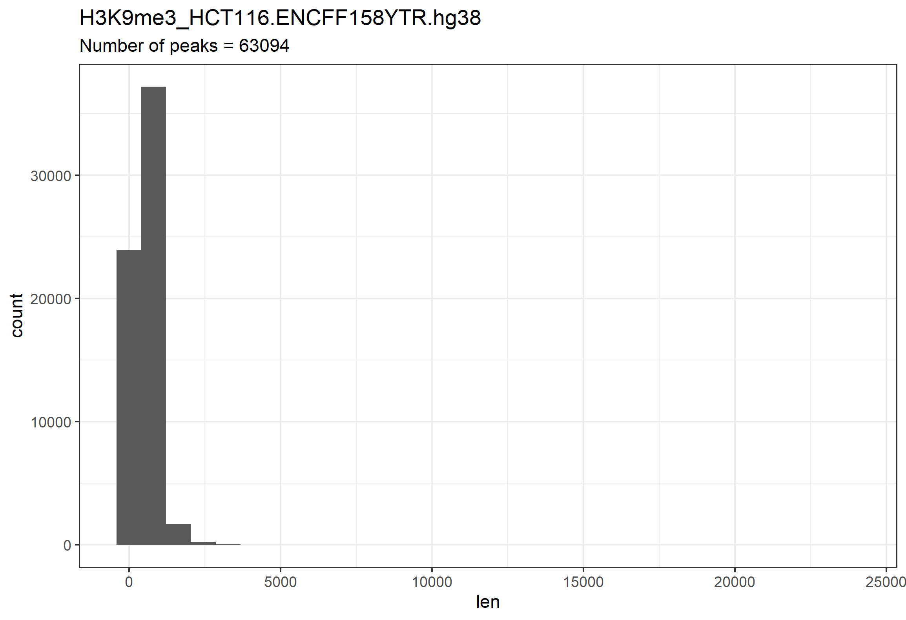
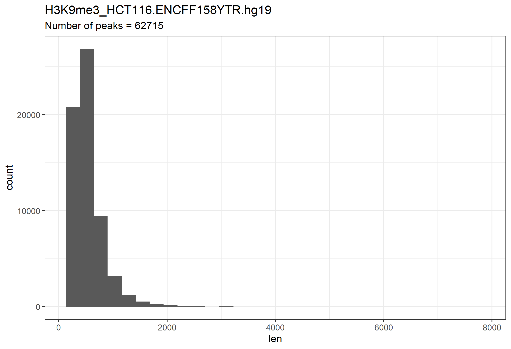
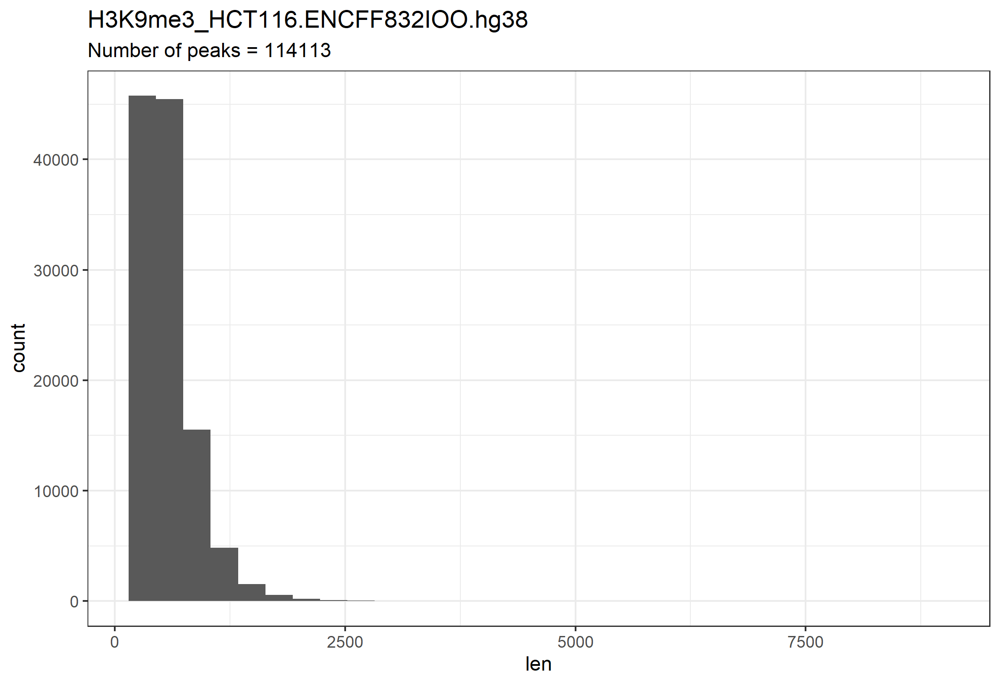
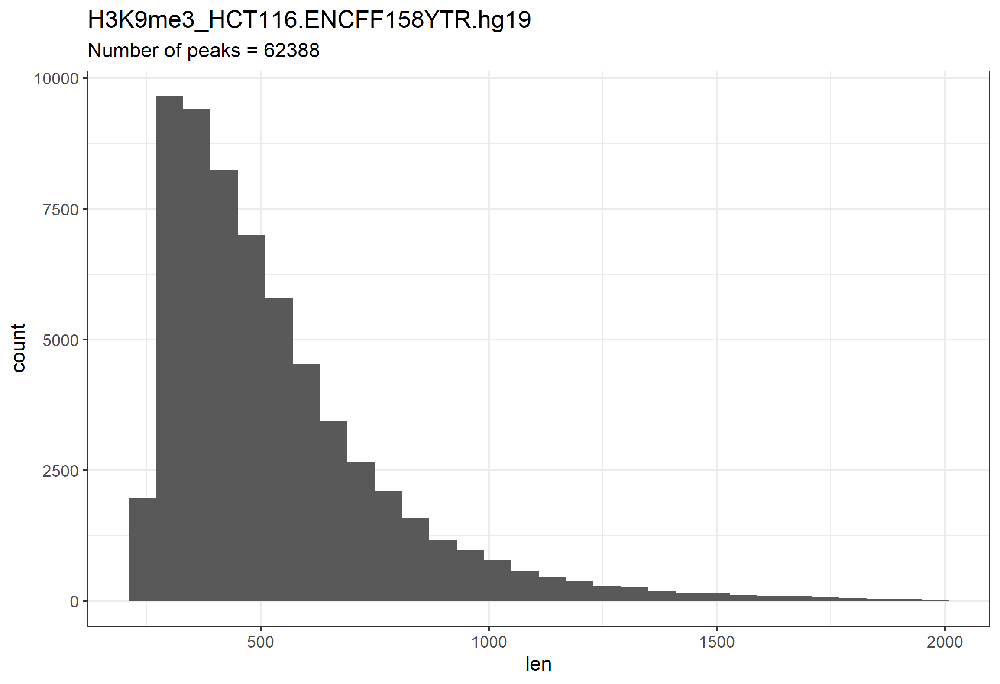
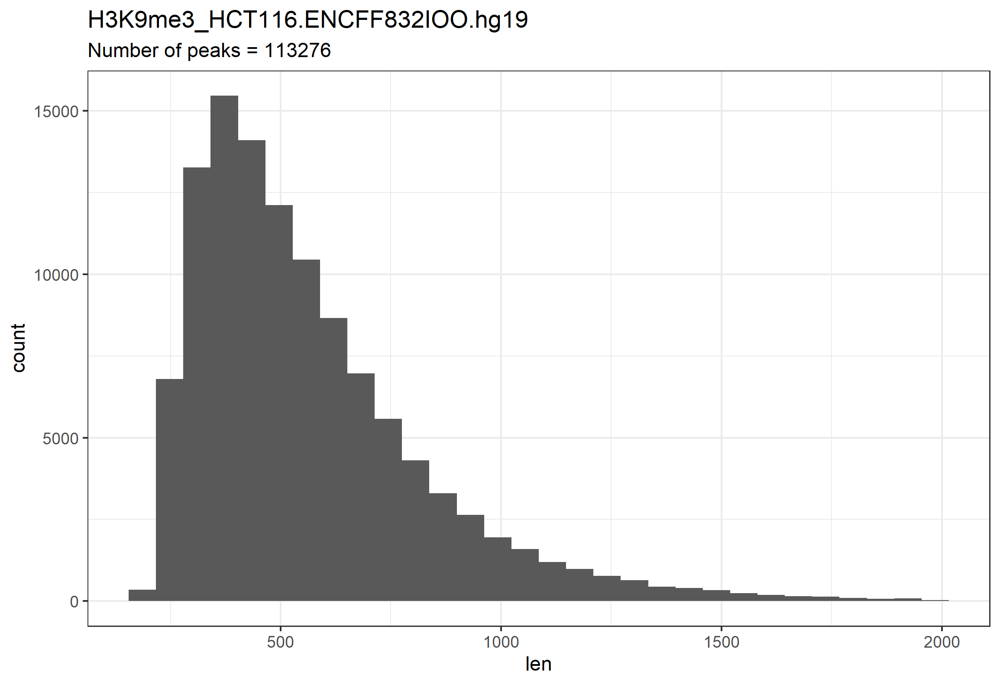
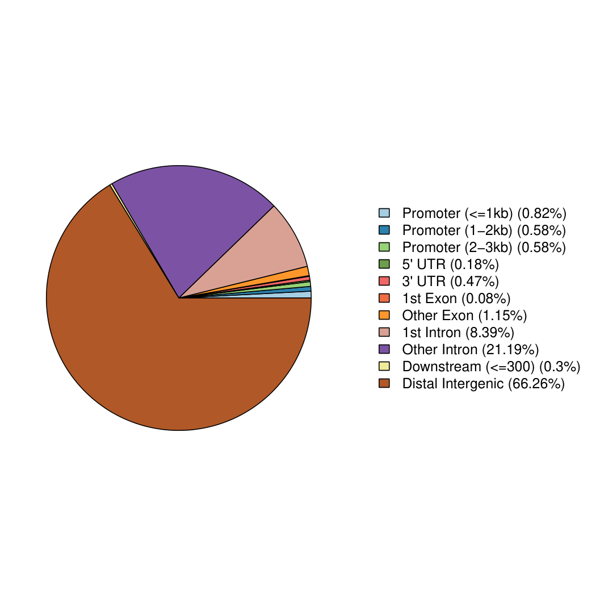
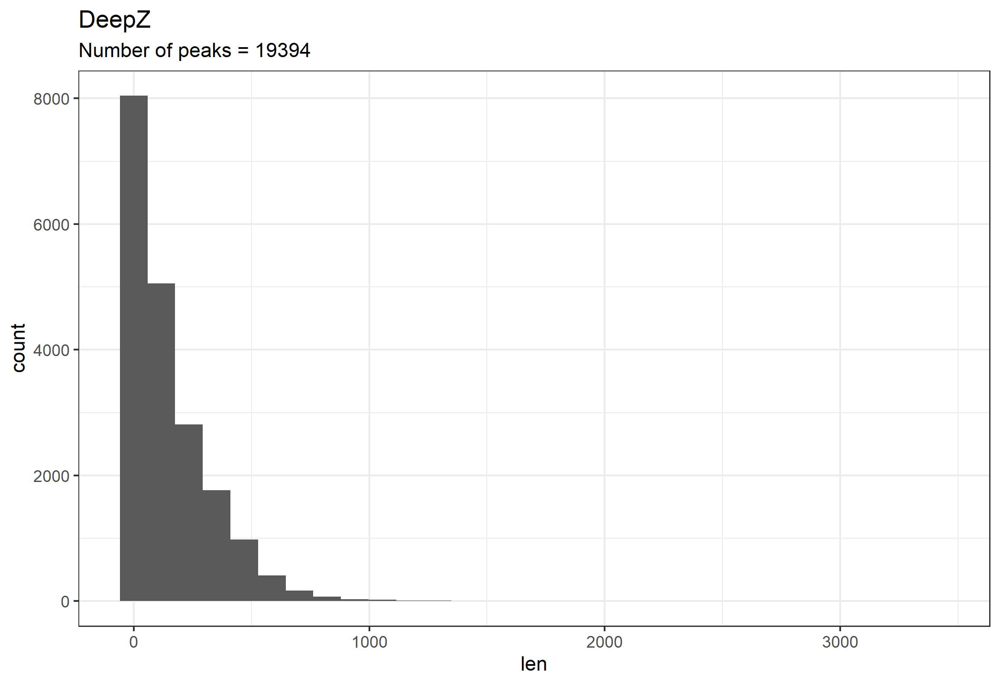
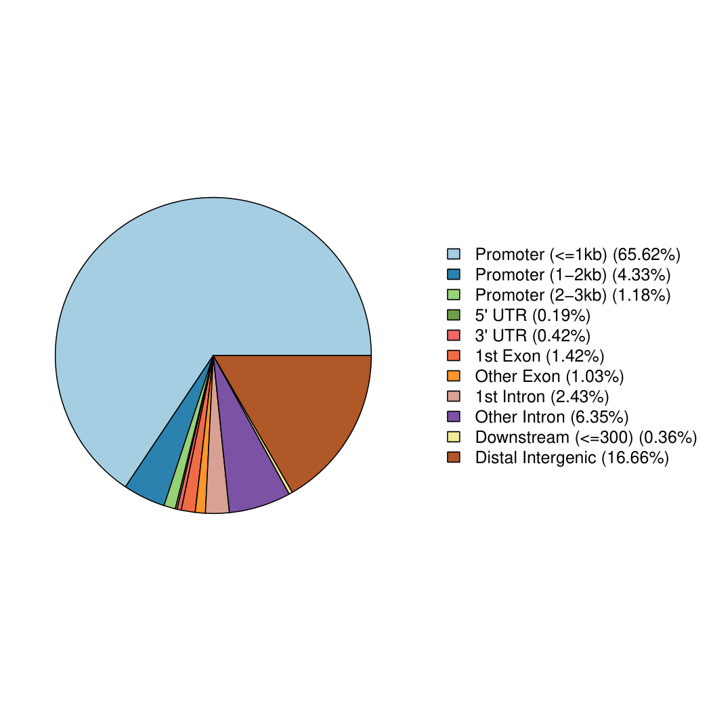
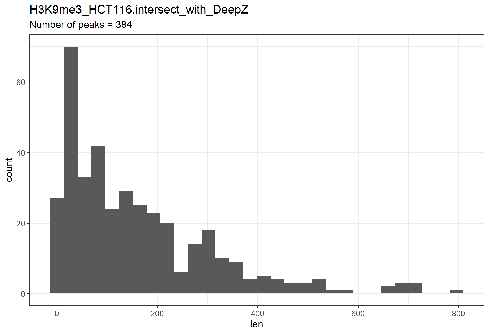
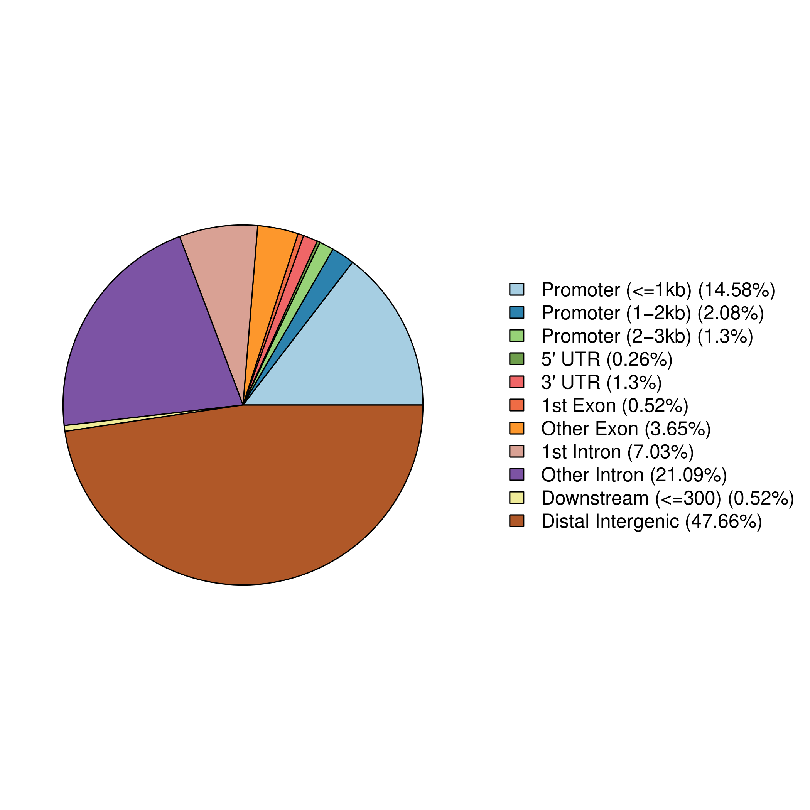

# hse21_H3K9me3_ZDNA_human
Final project on "Bioinformatics" course

Организм: Homo Sapiens.

Гистоновая метка: H3K9me3.

Тип клеток: HCT116.

ChIP-seq эксперименты (ENCODE):
- [ENCFF158YTR](https://www.encodeproject.org/files/ENCFF158YTR/)
- [ENCFF832IOO](https://www.encodeproject.org/files/ENCFF832IOO/)

## 1. Анализ пиков гистоновой метки.

### 1.1. Распределение длин участков

Ниже приведены гистограммы распределения длин участков для каждого из экспериментов (ENCFF158YTR, ENCFF832IOO) до и после конвертации из версии генома hg38 в hg19.

Конвертация hg38 -> hg19 произведена с помощью `liftOver`:

```bash
wget https://hgdownload.cse.ucsc.edu/goldenpath/hg38/liftOver/hg38ToHg19.over.chain.gz
liftOver H3K9me3_HCT116.ENCFF158YTR.hg38.bed hg38ToHg19.over.chain.gz H3K9me3_HCT116.ENCFF158YTR.hg19.bed H3K9me3_HCT116.ENCFF158YTR.unmapped.bed
liftOver H3K9me3_HCT116.ENCFF832IOO.hg38.bed hg38ToHg19.over.chain.gz H3K9me3_HCT116.ENCFF832IOO.hg19.bed H3K9me3_HCT116.ENCFF832IOO.unmapped.bed
```

Скрипт для построения гистограмм приведен в [len_hist.R](./src/len_hist.R)

#### 1.1.1. Эксперимент ENCFF158YTR

- версия генома hg38


- после конвертации в версию генома hg19


#### 1.1.2. Эксперимент ENCFF832IOO

- версия генома hg38


- после конвертации в версию генома hg19


#### 1.1.3. Комментарии

- Распределение длин не поменялось
- Есть длинные участки в ENCFF158YTR (~20Kb), которые не конвертировались. Поскольку следующим шагом мы все равно удалим длинные участки, это не критично.

### 1.2. Фильтрация выбросов по длине

Для каждого из экспериментов удалены пики, которые имеют длину (> 2000). Ниже приведены гистограммы распределения длин участков после удаления.

Скрипт для фильтрации и построения гистограмм приведен в [filter_peaks.R](./src/filter_peaks.R)

#### 1.2.1. Эксперимент ENCFF158YTR

После фильтрации осталось 62388 (99.48%) участков.



#### 1.2.2. Эксперимент ENCFF832IOO

После фильтрации осталось 113276 (99.27%) участков.



### 1.3. Расположение участков

Смотрим, где располагаются пики гистоновой метки относительно аннотированных генов. Ниже приведены pie-chart, соответствующие экспериментам.

Скрипт приведен в [chip_seeker.R](./src/chip_seeker.R), в нем используется библиотека `ChIPseeker`.

#### 1.3.1. Эксперимент ENCFF158YTR


#### 1.3.2. Эксперимент ENCFF832IOO



### 1.4. Объединение участков

Два отфильтрованных набора участков были объединены с помощью утилиты `bedtools merge` командой:

```bash
cat *.filtered.bed | sort -k1,1 -k2,2n | bedtools merge > H3K9me3_HCT116.merge.hg19.bed
```

Эти наборы затем были провизуализированы в Genome Browser для проверки корректности `bedtools merge`. В целях экономии пространства скриншоты будут прикреплены ниже, после выполнения дальнейших этапов (уже с новой информацией).

## 2. Анализ участков вторичной структуры ДНК

Участки вторичной структуры ДНК были получены из репозитория [DeepZ](https://github.com/Nazar1997/DeepZ). С ними была проделана аналогичная работа, теми же скриптами.

### 2.1. Распределение длин участков



### 2.2. Расположение участков относительно аннотированных генов.



## 3. Анализ пересечений гистоновой метки и вторичной структуры ДНК

Рассматриваются пики гистоновой метки на вторичных структурах, т.е. рассматривается пересечение объединенных участков и участков вторичной структуры. Пересечения были получены с помощью утилиты `bedtools intersect`:

```bash
bedtools intersect -a DeepZ.bed -b H3K9me3_HCT116.merge.hg19.bed > H3K9me3_HCT116.intersect_with_DeepZ.bed
```

Далее с ними проделывается аналогичная работа, опять же теми же скриптами.

### 3.1. Распределение длин участков.

В результате: 381 участка.



### 3.2. Расположение участков относительно аннотированных генов.



---

За шаблон отчета благодарность [isaf27](https://github.com/isaf27).
